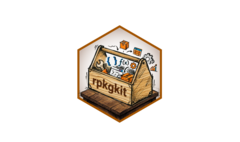

<!-- README.md is generated from README.Rmd. Please edit that file -->

# rpkgkit <a href="https://wanglabcsu.github.io/rpkgkit/"></a>

<!-- badges: start -->

[](https://lifecycle.r-lib.org/articles/stages.html#stable)
[](https://www.repostatus.org/#active)
[](https://CRAN.R-project.org/package=rpkgkit)
[](https://github.com/WangLabCSU/rpkgkit/actions/workflows/R-CMD-check.yaml)
[](https://github.com/WangLabCSU/rpkgkit)
[](https://github.com/WangLabCSU/rpkgkit)
[](https://app.codecov.io/gh/WangLabCSU/rpkgkit)
[](https://deepwiki.com/WangLabCSU/rpkgkit)
[](inst/translations/README.zh-cn.md)
[](https://cran.r-project.org/package=rpkgkit)
<!-- badges: end -->

The goal of rpkgkit is to provide useful functions for R package
development.

## Installation

From CRAN:

``` r
install.packages("rpkgkit")
```

From github:

``` r
if (!requireNamespace("pak")) {
  install.packages(
    "pak",
    repos = sprintf(
      "https://r-lib.github.io/p/pak/stable/%s/%s/%s",
      .Platform$pkgType,
      R.Version()$os,
      R.Version()$arch
    )
  )
}
pak::pak("Exceret/rpkgkit")
```

## Features

All functions can detect active file contexts in RStudio and Positron,
so generally file path can be omitted.

### Available Standalone Scripts

Use `usethis::use_standalone("WangLabCSU/rpkgkit", "<name>")` to import:

- args_to_func.R: matching arguments to function calls:

<!-- -->

``` r
f1 <- function(a, b) a + b
f2 <- function(x, y, ...) x * y
f3 <- function(p, q) p - q

args <- list(a = 1, b = 2)

# Strict matching (default): returns f1 only
match_func_to_args(args, f1, f2, f3)
```

``` r
args <- list(a = 1, b = 2, x = 3, y = 4)
foo <- function(x , y = 1){x + y}
filter_args_for_func(args, foo) # Keeps arguments for foo
# $x
# [1] 3

# $y
# [1] 4
```

- caller_cli.R: show where the cli function is called from

<!-- -->

``` r
decorated <- add_caller_to_cli(cli::cli_alert_info)
foo1 <- \() {
  print("I' m in foo1")
  decorated("<- where is this called from?")
}
foo2 <- \() {
  print("I' m in foo2")
  foo1()
}
bar <- function() {
  print("I' m in bar")
  foo2()
}
bar()
# [1] "I' m in bar"
# [1] "I' m in foo2"
# [1] "I' m in foo1"
# ℹ [foo1()]: <- where is this called from?
```

- colorful_cli.R: Easier color calling in one cli function

<!-- -->

``` r
color_cli <- create_colorful_cli_env()
color_cli$cli_alert_danger("{.red This is a red message}")
color_cli$cli_alert_info("{.blue This is a blue message}")
color_cli$cli_alert_info("{.orange This is an orange message}")
# cyan, green, magenta, yellow, purple, etc

color_cli2 <- create_colorful_cli_env(cli_theme = generate_color_theme()) # more color but slower
color_cli2$cli_alert_success(
  "{.violetred3 R}{.orange a}{.yellow i}{.green n}{.cyan b}{.blue o}{.purple w}"
)
```

- match_arg.R: partial matching of arguments to function calls, like
  `match.arg`, `rlang::arg_match`

- ts_cli.R: timestamp cli function

<!-- -->

``` r
ts_cli <- create_ts_cli_env()
ts_cli$cli_alert_info("Hello, world!")
# ℹ [2026/05/30 22:45:42] Hello, world!
```

### Standalone File Management

- `inquire_standalone()` - List standalone files available in a GitHub
  repository’s `R/` directory

- `browse_standalone()` - Look up all available standalone files in
  GitHub repositories

<!-- -->

``` r
inquire_standalone("r-lib/rlang")
# A tibble: 13 × 9
#    name                         path                           sha                                       size url                               html_url git_url download_url type
#    <chr>                        <chr>                          <chr>                                    <int> <chr>                             <chr>    <chr>   <chr>        <chr>
#  1 standalone-cli.R             R/standalone-cli.R             14c6006f721028d2da0ab1654afd49e426e745c6 18672 https://api.github.com/repos/r-l… https:/… https:… https://raw… file
#  2 standalone-downstream-deps.R R/standalone-downstream-deps.R 09b7700582bf710498d2ca5652662669655e5600  9213 https://api.github.com/repos/r-l… https:/… https:… https://raw… file
#  3 standalone-lazyeval.R        R/standalone-lazyeval.R        50ced0ddc07e4fffccbec96ef34e30a82cfbb075  2313 https://api.github.com/repos/r-l… https:/… https:… https://raw… file
#  4 standalone-lifecycle.R       R/standalone-lifecycle.R       70f03184aa89aa7e801b2fc6b8a12dd3a0e61700  6411 https://api.github.com/repos/r-l… https:/… https:… https://raw… file
#  5 standalone-linked-version.R  R/standalone-linked-version.R  9ab21931a161722b6b837fa3cd40dd0a65b88551  2167 https://api.github.com/repos/r-l… https:/… https:… https://raw… file
#  6 standalone-obj-type.R        R/standalone-obj-type.R        e9c33c8e34f2a194c2bd71f0126fc0bdaa974e61  7175 https://api.github.com/repos/r-l… https:/… https:… https://raw… file
#  7 standalone-purrr.R           R/standalone-purrr.R           0c1d7677258aada8464e6c3f48fb70a062492a89  5501 https://api.github.com/repos/r-l… https:/… https:… https://raw… file
#  8 standalone-rlang.R           R/standalone-rlang.R           4da3655d2d1c86535616c53cd5dab421e1e0cf6b  1807 https://api.github.com/repos/r-l… https:/… https:… https://raw… file
#  9 standalone-s3-register.R     R/standalone-s3-register.R     05f0a2680fcbbdda64524ffa5481940671faac83  6056 https://api.github.com/repos/r-l… https:/… https:… https://raw… file
# 10 standalone-sizes.R           R/standalone-sizes.R           03ee9f7a8ddddd6132a3ebf703e0a9aa3ccf30d5  3069 https://api.github.com/repos/r-l… https:/… https:… https://raw… file
# 11 standalone-types-check.R     R/standalone-types-check.R     42c756a299cea38af775b587a1fe440de2afed40  6843 https://api.github.com/repos/r-l… https:/… https:… https://raw… file
# 12 standalone-vctrs.R           R/standalone-vctrs.R           a78927f6d65fd769c61e2c132dea05d89a8b353a 14292 https://api.github.com/repos/r-l… https:/… https:… https://raw… file
# 13 standalone-zeallot.R         R/standalone-zeallot.R         5e9d59a03e1d6df18ab4921e7d828750d6a41d6f   843 https://api.github.com/repos/r-l… https:/… https:… https://raw… file

browse_standalone()
# # A tibble: 184 × 9
#    repo                   name                             path                               sha                 url   html_url git_url repo_url repo_description
#    <chr>                  <chr>                            <chr>                              <chr>               <chr> <chr>    <chr>   <chr>    <chr>           
#  1 tidymodels/parsnip     standalone-survival.R            R/standalone-survival.R            3f3809cc6019326a7f… http… https:/… https:… https:/… A tidy unified …
#  2 prioritizr/prioritizr  standalone-cli.R                 R/standalone-cli.R                 00453fe89a55497eba… http… https:/… https:… https:/… Systematic cons…
#  3 r-lib/rlang            standalone-vctrs.R               R/standalone-vctrs.R               a78927f6d65fd769c6… http… https:/… https:… https:/… Low-level API f…
#  4 cran/prioritizr        standalone-all_columns_inherit.R R/standalone-all_columns_inherit.R 2c08f0fdc2e3749b46… http… https:/… https:… https:/… :exclamation: T…
#  5 ai4ci/tidyabc          standalone-distributions.R       R/standalone-distributions.R       249a19d425c208db51… http… https:/… https:… https:/… R framework for…
#  6 terminological/ggrrr   standalone-empirical.R           R/standalone-empirical.R           4bcde2d56ddc24ae9d… http… https:/… https:… https:/… Data presentati…
#  7 WangLabCSU/SigBridgeR  standalone-get_var_value.R       R/standalone-get_var_value.R       6331dae57b7e759122… http… https:/… https:… https:/… SigBridgeR: Int…
#  8 willgearty/deeptime    standalone-obj-type.R            R/standalone-obj-type.R            106accce773ab162cd… http… https:/… https:… https:/… An R package th…
#  9 ddsjoberg/standalone   standalone-check_pkg_installed.R R/standalone-check_pkg_installed.R 571303b0f4e689ab4d… http… https:/… https:… https:/… Standalone scri…
# 10 elipousson/standaloner standalone-extra-checks.R        R/standalone-extra-checks.R        75bda8f557cfcae29e… http… https:/… https:… https:/… Set or get a to…
# # ℹ 174 more rows
```

- `create_standalone()` - Create standalone utility files in your
  package

``` r
create_standalone("foo")
# ✔ Created standalone file: /data/home/yyx/Project/rpkgkit/R/standalone-.R
# ☐ File opened in editor.
```

In `R/standalone-foo.R`

``` r
# ---
# repo: WangLabCSU/rpkgkit
# file: standalone-foo.R
# last-updated: 2026-06-02
# license: https://unlicense.org
# imports: []
# ---
# 
# This file provides...
#
# nocov start
```

- `update_time_in_standalone()` - Update `last-updated` field in
  standalone files

<!-- -->

``` r
update_time_in_standalone()

# ---
# repo: WangLabCSU/rpkgkit
# file: standalone-foo.R
# last-updated: 2026-06-02
# license: https://unlicense.org
# imports: []
# ---
```

- `add_changelog_in_standalone()` - Add changelog entries to standalone
  files.

<!-- -->

``` r
add_changelog_in_standalone("R/standalone-foo.R", "Added foo function")
# ✔ Added changelog entry for "2026-06-02" in 1 file(s).

# ---
# repo: WangLabCSU/rpkgkit
# file: standalone-foo.R
# last-updated: 2026-06-02
# license: https://unlicense.org
# imports: []
# ---
#
# Changelog:
#
# 2026-06-02:
# Added foo function
```

### NEWS.md Management

- `news_md_add_entry()` - Add new entries to NEWS.md following CRAN
  guidelines

<!-- -->

``` r
news_md_add_entry("Added foo function")
```

    # rpkgkit 0.0.4 (2026-06-02)

    ## NEW FEATURES

    * Added foo function

Add a different entry

``` r
news_md_add_entry(
  entry = "Fixed bugs in `foo()`",  
  version = "0.0.4",
  category = "BUG FIXES"
)
```

    # rpkgkit 0.0.4 (2026-06-02)

    ## NEW FEATURES

    * Added foo function

    ## BUG FIXES

    * Fixed bugs in `foo()`

- `news_md_check()` - Validate NEWS.md format for CRAN compliance

<!-- -->

``` r
news_md_check()
# ℹ Checking NEWS.md with 22 lines
# ✔ NEWS.md passed all required checks
# ℹ 4 suggestion(s) for improvement
# $valid
# [1] TRUE

# $errors
# character(0)

# $warnings
# character(0)

# $suggestions
# [1] "Line 10: Bullet points should start with '* ' followed by capital letter"
# [2] "Line 12: Bullet points should start with '* ' followed by capital letter"
# [3] "Line 14: Bullet points should start with '* ' followed by capital letter"
# [4] "Line 14: Longer entries should end with punctuation"
```

- `news_md_show()` - Display NEWS.md content of a package in console
  with color

### R Function Transformation

- `make_func_call_explicit()` - Make function calls explicit by adding
  package prefixes
- `package_func_call_explicit()` - Make function calls explicit by
  adding package prefixes in a package

This is a code snippet from [dplyr](https://github.com/tidyverse/dplyr)

``` r

starwars |>
  mutate(name, bmi = mass / ((height / 100)^2)) |>
  select(name:mass, bmi)

make_func_call_explicit("path_to_file", use_packages = "dplyr")
```

It will be converted to

``` r
starwars |>
  dplyr::mutate(name, bmi = mass / ((height / 100)^2)) |>
  dplyr::select(name:mass, bmi)
```

- `detect_lost_glue_brace()` - Find all `glue` calls that are missing a
  closing brace in a file. Supports both `glue` and `cli` expressions.
- `package_lost_glue_brace()` - Find all `glue` calls that are missing a
  closing brace in a package. Supports both `glue` and `cli`
  expressions.

``` r
# foo.R
name <- "world"
msg <- glue::glue("Hello, {name!")

library(cli)
warning <- ""
bar <- cli::col_red(cli::cli_alert_warning(
  "{.field warning}}: This string is missing {.val 1} brace{?s}"
))
```

``` r
detect_lost_glue_brace()

# msg <- glue::glue("Hello, {name!")
#                           ^^^^^^ 

#   "{.field warning}}: This string is missing {.val 1} brace{?s}"
#    ^^^^^^^^^^^^^^^^^ 
# ✖ Found 2 lines with mismatched braces: 3 and 8
```

- `make_func_arg_explicit()` - Make function arguments are passed with
  explicit parameter names
- `package_func_arg_explicit()` - Make function arguments are passed
  with explicit parameter names in a package

``` r
tf <- tempfile(fileext = ".R")
writeLines("vapply(1:9, function(x) x*2, numeric(1))", tf)
make_func_arg_explicit(tf)
# ✔ Made function arguments explicit in /tmp/RtmpOr1Iz0/file15b76c2120b264.R

cat(readLines(tf), sep = "\n")
# vapply(X = 1:9, FUN = function(x) x * 2, FUN.VALUE = numeric(length = 1))
```

- `rename_func()` - Rename functions in a file with specific style

``` r
tf <- tempfile(fileext = ".R")
writeLines("this_is_a_function <- function(){message('Hello, world')}", tf)

rename_func(
  tf,
  style = "camelCase"
)
# ✔ Renamed 1 function to "camelCase" style in /tmp/RtmpOr1Iz0/file15b76c8de7e51.R

cat(readLines(tf), sep = "\n")
# thisIsAFunction <- function(){message('Hello, world')}
```

- `detect_print_and_cat()` - Detect `print()` and `cat()` calls in a
  file
- `package_print_and_cat()` - Detect `print()` and `cat()` calls in a
  package

`print()` and `cat()` are not allowed due to CRAN policy, so we need to
fix them with `message()`

``` r
tf <- tempfile(fileext = ".R")
writeLines("print('Hello, world')", tf)
detect_print_and_cat(tf)
# print('Hello, world')
# ^^^^^^
# ✖ Found 1 unsupported call on line 
# 1.
detect_print_and_cat(tf, fix = TRUE)
cat(readLines(tf), sep = "\n")
# message('Hello, world')
```

- `convert_func_syntax()` - Convert function syntax between `function()`
  and `\()`

``` r
f <- tempfile(fileext = ".R")
writeLines("f <- function(x) x^2", f)
convert_func_syntax(f)
# ✔ Converted function definitions in /tmp/Rtmp9ftJDS/file2a5a1320c9342e.R to "to_lambda"
message(readLines(f), sep = "\n")
# f <- \(x) x^2

convert_func_syntax(f, "to_explicit")
# ✔ Converted function definitions in /tmp/Rtmp9ftJDS/file2a5a1320c9342e.R to "to_explicit"
message(readLines(f), sep = "\n")
# f <- function(x) x^2
```

### R Package Maintenance

- `use_zzz()` - Create `{pkgname}-package.R` file in `R/` folder, with
  `.onLoad`, `.onAttach`, `%||%` and package description. Similar to
  `usethis::use_package_doc()` but more powerful.

``` r
# * E.g., use it in rpkgkit dev environment
use_zzz()

# #' @title Create and Maintain R Packages
# #'
# #' @description Utilities for R package development including NEWS.md
# #' management, standalone file creation, and code formatting. Supports popular
# #' development workflows and integrates with 'usethis' and 'RStudio'. Includes
# #' helper functions for renaming functions and detecting common coding errors.
# #'
# #' @section License:
# #' MIT + file LICENSE
# #'
# #' @docType package
# #' @name rpkgkit-package
# #' @aliases rpkgkit
# #' @keywords internal
# #'
# "_PACKAGE"


# .onAttach <- function(libname, pkgname) {
#   pkg_version <- utils::packageVersion(pkgname)

#   msg <- cli::cli_fmt(cli::cli_alert_success(
#     "{.pkg {pkgname}} v{pkg_version} loaded"
#   ))
#   packageStartupMessage(msg)
#   invisible()
# }

# .onLoad <- function(libname, pkgname) {
#   invisible()
# }

# `%||%` <- function(left, right) {
#   if (is.null(left)) {
#     return(right)
#   }
#   left
# }
```

- `check_pkgdown_reference()` - Check if all exported function are
  referenced in `_pkgdown.yml`

``` r
check_pkgdown_reference()
# ✖ 9 exported functions missing from pkgdown reference:
# - current_packages
# - detect_lost_glue_brace
# - detect_print_and_cat
# - imported_functions
# - make_func_arg_explicit
# - make_func_call_explicit
# - news_md_add_entry
# - news_md_check
# - news_md_show
```

- `use_vendor()` - Reference a permissively-licensed R package from
  GitHub for inclusion in your own R package. Make it easy to import
  github R package under CRAN policy.

License, copyright and declaration are automatically generated in
`DESCRIPTION`, `R/vendor-*.R` and `inst/vendor/`.

``` r
dir <- tempdir()
usethis::create_package(path = dir)
use_vendor(pkg = "WangLabCSU/rpkgkit", "43_use_vendor.R", branch = "main", path = dir)
# ℹ Fetching repository information for WangLabCSU/rpkgkit...
# ✔ Vendor package uses MIT license.
# ✔ Created directory /tmp/RtmpOr1Iz0/inst/vendor/rpkgkit.
# ✔ Copied LICENSE.
# ✔ Copied LICENSE.md.
# ✔ Created inst/vendor/rpkgkit/README.md.
# ✔ Created /tmp/RtmpOr1Iz0//R/vendor-rpkgkit.R.
# ✔ Added rpkgkit authors to Authors@R.
# ✔ Updated DESCRIPTION.
# ☐ Consider pasting the following statement into README.md

# ## Acknowledgements

# We would like to thank the following people and projects:

# - The authors of the [rpkgkit](https://github.com/WangLabCSU/rpkgkit) package &mdash; **Yuxi Yang, Jacob Scott, Christopher T. Kenny, Sebastian Lammers and Diego Hernangómez** &mdash; whose code is included (under MIT license) in `R/vendor-rpkgkit.R`.
```

- `use_multilanguage_readme()` - Create a multi-language README.md
  template for your R package.
- `badge_translated_by_ai()` - Create a badge for translated by AI.

``` r
use_multilangauge_readme("es")
# ✔ Created 1 README translation file in inst/translations.
# ☐ Consider pasting the following badges into your main README.md:

# [](inst/translations/README.es.md)
```

``` r
badge_translated_by_ai("es")
# ☐ Consider copying the following statement to the AI-translated file(s):

# []()

# > Este contenido ha sido traducido por IA y no ha sido revisado. No es la lengua materna del autor y es solo para referencia.
```

- `Add_global_rbuildignore()` - Add global .Rbuildignore file to your R
  package.
- `Add_global_gitignore()` - Add global .gitignore file to your R
  package.

## Acknowledgements

We would like to thank the following people and projects:

- The authors of the [pedant](https://github.com/wurli/pedant) package —
  **Jacob Scott**, **Christopher T. Kenny**, and **Sebastian Lammers** —
  whose code is included (under MIT license) in `R/vendor-pedant.R`.
- The authors of the [pkgdev](https://github.com/dieghernan/pkgdev)
  package — **Diego Hernangómez** — whose code is included (under MIT
  license) in `R/vendor-pkgdev.R`.
- All contributors and users who have reported issues, suggested
  features, or helped improve the package.
