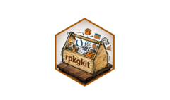

# rpkgkit <a href="https://wanglabcsu.github.io/rpkgkit/"></a>

<!-- badges: start -->
[](https://lifecycle.r-lib.org/articles/stages.html#stable)
[](https://www.repostatus.org/#active)
[](https://CRAN.R-project.org/package=rpkgkit)
[](https://github.com/WangLabCSU/rpkgkit/actions/workflows/R-CMD-check.yaml)
[](https://github.com/WangLabCSU/rpkgkit)
[](https://github.com/WangLabCSU/rpkgkit)
[](https://app.codecov.io/gh/WangLabCSU/rpkgkit)
[](https://deepwiki.com/WangLabCSU/rpkgkit)
[](https://cran.r-project.org/package=rpkgkit)
[](../../README.md)
[](README.es.md)
[]()
[](https://github.com/WangLabCSU/rpkgkit/commits/main)
<!-- badges: end -->

## 概览

`rpkgkit` 为创建和维护 R 包提供实用工具。其函数覆盖独立脚本管理、`NEWS.md` 维护、R 源代码现代化、包基础设施配置和 README 文件维护等常见开发任务。

多数函数可以检测 RStudio 和 Positron 中的活动文件上下文，因此通常可以省略文件路径。

## 安装

从 CRAN 安装已发布版本：

```r
install.packages("rpkgkit")
```

从 r-universe 安装开发版本：

```r
install.packages(
  "rpkgkit",
  repos = c("https://wanglabcsu.r-universe.dev", "https://cloud.r-project.org")
)
```

或从 GitHub 安装：

```r
pak::pak("WangLabCSU/rpkgkit")
```

## 指南

包网站按任务整理了可直接使用的详细示例：

- [rpkgkit 独立脚本](https://wanglabcsu.github.io/rpkgkit/articles/standalone_tools.html)：导入独立工具、维护其元数据，以及查找或创建独立文件。
- [代码转换](https://wanglabcsu.github.io/rpkgkit/articles/code_convertion.html)：为包调用添加命名空间、检查源代码、转换语法，以及处理整数或非 ASCII 字面量。
- [编辑 NEWS](https://wanglabcsu.github.io/rpkgkit/articles/news.html)：创建、更新、显示和验证 `NEWS.md` 条目。
- [包设置与维护](https://wanglabcsu.github.io/rpkgkit/articles/pkg_maintain.html)：配置包基础设施、引入宽松许可证代码，以及管理忽略文件。
- [README 与文档工具](https://wanglabcsu.github.io/rpkgkit/articles/readme_and_doc.html)：创建 README 翻译文件，以及插入或生成徽章。

## 致谢

感谢以下人员和项目：

- [pedant](https://github.com/wurli/pedant) 包的作者 **Jacob Scott**、**Christopher T. Kenny** 和 **Sebastian Lammers**；其代码以 MIT 许可证收录在 `R/vendor-pedant.R` 中。
- [pkgdev](https://github.com/dieghernan/pkgdev) 包的作者 **Diego Hernangómez**；其代码以 MIT 许可证收录在 `R/vendor-pkgdev.R` 中。
- 所有报告问题、提出功能建议或帮助改进本包的贡献者和用户。
